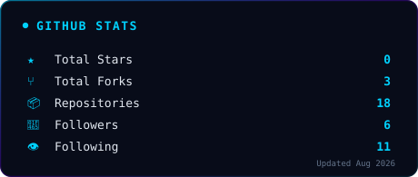
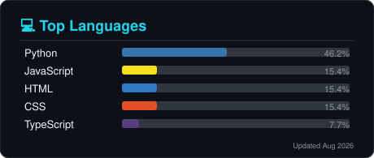

<!--
  HARISH AI // NEURAL COMMAND CENTER
  Premium · Minimal · Futuristic · AI Operating System
  Aesthetic: Apple × OpenAI × NASA Mission Control
-->

 

<h1>
  <samp>HARISH&nbsp;AI</samp>
</h1>

<h3>
  <samp>Neural Command Center</samp>
</h3>

  

<em>Building intelligent systems that solve real-world problems.</em>

  

 

 

 

> AI & Data Science engineer specializing in Machine Learning and Deep Learning.
> Bridging cutting-edge research with practical applications through data-driven solutions.
> Focused on Python development, intelligent systems, and solving complex real-world problems.

 

 

 

### Programming

### AI / ML

### Web

### Cloud

### Tools

 

 

 

<table width="100%">
<tr>
<td width="50%" valign="top">

<h3>🌾 Smart Agricultural System</h3>

AI-powered smart agriculture platform providing crop monitoring, irrigation recommendations, disease detection, and intelligent farming insights.

<strong>Status:</strong> 🟢 Completed

</td>
<td width="50%" valign="top">

<h3>🌤️ Smart Weather Prediction</h3>

Machine learning weather forecasting system trained on historical datasets to predict future weather conditions with high accuracy.

<strong>Status:</strong> 🟢 Completed

</td>
</tr>
<tr>
<td width="50%" valign="top">

<h3>📊 Customer Churn Prediction</h3>

Machine learning model that predicts telecom customer churn using Logistic Regression, helping businesses improve retention strategies.

<strong>Status:</strong> 🟢 Completed

</td>
<td width="50%" valign="top">

<h3>🏷️ Price Detection System</h3>

Computer vision and OCR-based application for automatic product price detection and recognition using image processing.

<strong>Status:</strong> 🟢 Completed

</td>
</tr>
</table>

 

 

 

<table width="100%">
<tr>
<td width="50%" align="center">

</td>
<td width="50%" align="center">

</td>
</tr>
<tr>
<td width="50%" align="center">

</td>
<td width="50%" align="center">

</td>
</tr>
</table>

 

 

 

 

 

  

**Thanks for visiting.** · Made with ❤️ by Harish M

