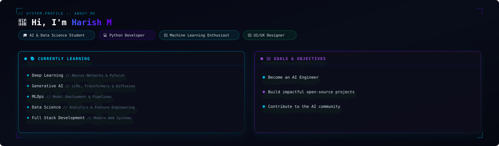

  

  

 

# 👋 Hi, I'm Harish M

🎓 **AI & Data Science Student** | 💻 **Python Developer** | 🤖 **Machine Learning Enthusiast** | 🎨 **UI/UX Designer**

---

### 📚 Currently Learning
- ⚡ **Deep Learning** — *Neural Networks & PyTorch*
- 🤖 **Generative AI** — *LLMs, Transformers & Diffusion Models*
- 🔄 **MLOps** — *Model Deployment & Automated Pipelines*
- 📊 **Data Science** — *Analytics & Feature Engineering*
- 🌐 **Full Stack Development** — *AI Web Applications*

### 🎯 Goals
- 🚀 **Become an AI Engineer**
- 🛠️ **Build impactful open-source projects**
- 🤝 **Contribute to the AI community**